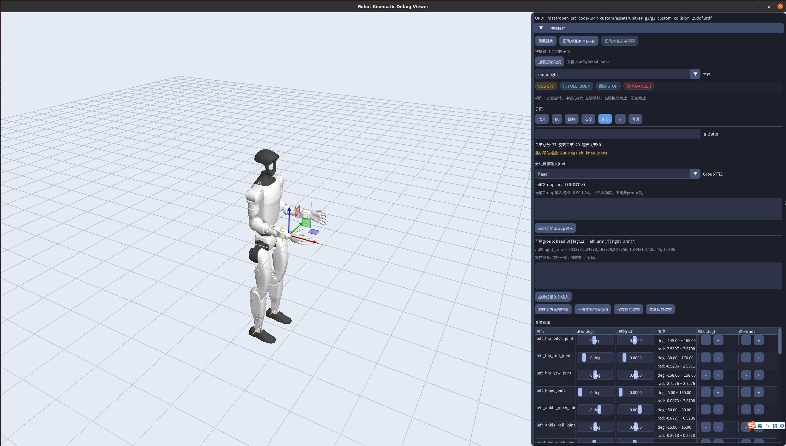

# Robot Kinematic Viewer
### 机器人运动学调试器 · IK 求解 · 轨迹回放 · 碰撞监控 · 视频录制

---

## 目录

- [主要能力](#主要能力)
- [预览](#预览)
- [跳舞回放演示](#跳舞回放演示)
- [核心流程](#核心流程)
- [仓库结构](#仓库结构)
- [依赖环境](#依赖环境)
- [快速开始](#快速开始)
- [RViz 联调示例](#rviz-联调示例)
- [配置说明](#配置说明)
- [文档](#文档)
- [轨迹回放（CSV）](#轨迹回放csv)
- [轨迹规划](#轨迹规划)
- [障碍物 IO](#障碍物-io)
- [视频录制](#视频录制)
- [后续规划](#后续规划)

---

## 主要能力

- OpenGL + ImGui 交互式机器人 3D 视图
- `single_chain` / `full_body` IK 模式切换
- 关键帧录制与轨迹回放
- 内置轨迹规划页：画圆、画方、头部往复、直线、关节空间 PTP
- 基于代理球（proxy sphere）的最小距离安全监控
- 用户障碍物编辑、视口点选与 YAML 导入导出
- 轨迹文件列表可持久化到 YAML 配置
- YAML 配置轮询热刷新
- 可选 ROS 外部目标位姿接入
- **MP4 / GIF 视频录制与导出**，支持自定义存储路径和文件名

---

## 预览




---

## 跳舞回放演示

Galbot G1 在 Viewer 中回放跳舞轨迹的录屏（含底盘滑入与全身关节，轨迹来自 `/data/dance` 导入）：

**[assets/simplescreenrecorder-2026-05-21_11.21.13.mkv](assets/simplescreenrecorder-2026-05-21_11.21.13.mkv)**（约 9 MB）

录屏使用的默认轨迹：`config/trajectories/galbot_g1_dance_slide_in.csv`（10 s）。另有完整舞段 `galbot_g1_dance_full.csv`（约 56 s）、`galbot_g1_dance_pure.csv`、`galbot_g1_dance_left_action1.csv` 等，见 [轨迹回放](#轨迹回放csv)。

> MKV 在本地用常见播放器或浏览器打开即可观看；需克隆仓库或从 GitHub 下载该文件。

---

## 核心流程

```text
加载 URDF 与配置
  -> UI/外部目标输入
  -> IK 求解
  -> 场景状态更新
  -> 距离监控与风险分级
  -> 侧边栏与3D连线反馈
```

---

## 仓库结构

```text
robot_kinematic_viewer/
  assets/                  # 截图、GIF、跳舞回放录屏
  config/                  # 运行配置 + trajectories/
  scripts/                 # 构建、RViz、import_dance_trajectory.py
  include/                 # 对外头文件
  src/                     # 核心实现
  docs/                    # 设计文档、依赖安装指南
  deps/                    # 内置三方源码（imgui/imguizmo/glad/vp）
```

---

## 依赖环境

- CMake 3.16+
- C++17 编译器
- OpenGL / GLFW / GLEW / Assimp
- pinocchio / trac_ik / roscpp（ROS Noetic）
- yaml-cpp
- Eigen3
- qpOASES（full-body 后端推荐）
- FFmpeg（`libavcodec`、`libavformat`、`libavutil`、`libswscale`）— MP4 视频录制
- libgif — GIF 导出
- `deps/vp` 速度规划库已随仓库内置并参与 CMake 构建

**依赖安装方法见 [docs/DEPENDENCIES.md](docs/DEPENDENCIES.md)。**

---

## 快速开始

仅编译：

```bash
./build.sh
```

全量重编译：

```bash
./all_rebuild.sh
```

编译并生成可发布目录（含依赖收集）：

```bash
./auto_build.sh
```

使用配置文件启动：

```bash
./bin/robot_kinematic_viewer config/robot_kinematic_viewer.yaml
```

直接指定 URDF 启动：

```bash
./bin/robot_kinematic_viewer /绝对路径/robot.urdf
```

---

## RViz 联调示例

一键拉起 `roscore + interactive marker + viewer`：

```bash
./scripts/start_rviz_ik_stack.sh
```

常见参数：

```bash
./scripts/start_rviz_ik_stack.sh --ik-mode full_body --backend wbc_chain_ik --chain-index 0
./scripts/start_rviz_ik_stack.sh --pose-ik
```

---

## 配置说明

- 默认入口配置：`config/robot_kinematic_viewer.yaml`
- 程序首个参数若以 `.urdf` 结尾则按 URDF 直接启动，否则按 YAML 配置加载
- 在新机器上请先修改 YAML 中 `robot.urdf_path`
- 通过 YAML 启动时，程序会每 2 秒轮询一次配置文件，做轻量级运行时刷新
- 顶层配置项需保持为：
  - `window`、`robot`、`camera`、`ui`、`ik`、`ros`、`initial_pose`、`playback`
- `playback.trajectory_files` 与 `playback.selected_index` 会持久化侧边栏轨迹列表与当前选中项

---

## 文档

- 设计文档：`docs/ROBOT_KINEMATIC_VIEWER_DESIGN.md`
- 依赖安装：`docs/DEPENDENCIES.md`

---

## 轨迹回放（CSV）

录屏演示见 **[跳舞回放演示](#跳舞回放演示)**（`assets/simplescreenrecorder-2026-05-21_11.21.13.mkv`）。

侧边栏回放只支持 `.csv`。现在支持在侧边栏维护"轨迹文件列表"，启动时从 `config/robot_kinematic_viewer.yaml` 恢复，退出时回写。

CSV 格式：

```text
time,[可选 chassis_x],[可选 chassis_y],[可选 chassis_yaw],关节1,关节2,...
```

| 机器人                 | 示例 CSV                                               | 说明                                      |
| ---------------------- | ------------------------------------------------------ | ----------------------------------------- |
| Galbot G1              | `config/trajectories/galbot_g1_playback.csv`           | 含底盘平面轨迹（`chassis_x/y/yaw`，弧度） |
| Galbot G1 跳舞（手臂） | `config/trajectories/galbot_g1_dance_left_action1.csv` | 手臂段，底盘不动                          |
| Galbot G1 跳舞（底盘） | `config/trajectories/galbot_g1_dance_slide_in.csv`     | 10s 滑入+旋转（默认）                     |
| Galbot G1 跳舞（底盘） | `config/trajectories/galbot_g1_dance_pure.csv`         | ~4s 含底盘片段                            |
| Galbot G1 跳舞（完整） | `config/trajectories/galbot_g1_dance_full.csv`         | ~56s 全程含底盘                           |
| Unitree G1             | `config/trajectories/unitree_g1_playback.csv`          | 仅关节（配置中固定基座）                  |

CSV 表头：`time,<关节列...>`。若包含底盘，则使用 `chassis_x`、`chassis_y`、`chassis_yaw`。

**从 `/data/dance` 导入更多轨迹：**

```bash
python3 scripts/import_dance_trajectory.py \
  /data/dance/data/dance3/generate/pos/total_dance_data.csv \
  config/trajectories/galbot_g1_dance_full.csv --hz 30
```

Viewer 也可直接加载 dance 原始 CSV（`timestamp` 列、`chassis_z` 映射为 yaw）；**保存**时也只输出 CSV。

加载轨迹时会校验关节名与当前机器人是否匹配；不匹配时会弹窗提示并保留原回放状态。

---

## 轨迹规划

侧边栏 `规划 / Planning` 页可以从当前场景直接生成轨迹并装载到回放区：

- 笛卡尔路径：画圆、画方、头部往复、末端直线运动
- 关节空间 PTP：梯形速度曲线（`TVP`）与双 S 曲线（`DSVP`，基于 `deps/vp`）
- 每次规划可单独选择 `single_chain` 或 `full_body` IK 求解
- 支持生成后在 3D 视图中预览路径

当前推荐流程：先在规划页生成轨迹，再到回放页检查/播放，如需导出文件，使用回放页的"保存当前轨迹"。

---

## 障碍物 IO

障碍物面板现在支持更完整的编辑与文件流转：

- 新建 box / sphere / cylinder 三类障碍物
- 在 3D 视口里直接点选障碍物，并用 gizmo 调整位姿
- 复制、删除、过滤、清空障碍物列表
- 将障碍物集合导入/导出为 YAML（默认示例路径：`config/user_obstacles.yaml`）

---

## 视频录制

侧边栏新增"视频录制"面板，支持：

- **格式选择**：MP4（H.264）或 GIF
- **帧率设置**：1 ~ 120 fps
- **存储路径**：支持目录浏览器选择，也可手动输入
- **文件名**：支持自定义命名，留空则自动生成 `recording_YYYYMMDD_HHMMSS.mp4/gif`
- **实时状态**：录制中显示当前帧数和丢帧情况

录制通过 OpenGL 帧缓冲捕获画面，后台线程编码，不阻塞主渲染循环。

---

## 后续规划

- 用 URDF collision mesh 提升碰撞检测精度
- 完善碰撞对过滤策略可配置能力
- 补齐自动化回归测试

---

## License

TBD
